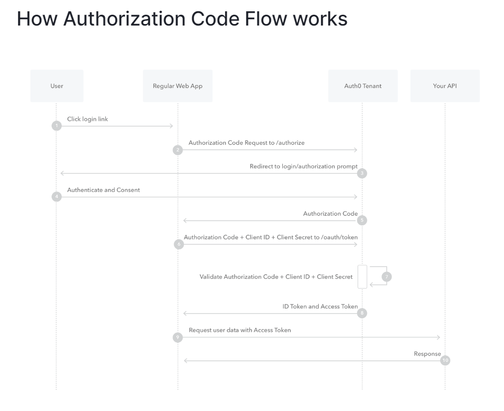

# Authentiraptor

Authentiraptor is a conceptual copy of OAuth2. This is made for understanding purposes, and is probably far from perfect.

To make a adequate prototype, I need the four main components present in OAuth2 operations.
- Client: The system that wants to access a protected resource 
- Authorization-server: The server that delivers token with user's consent
- Resource-owner: The user or system that owns the resource. We need it's consent to let their resource be accesed 
- Resource-server: The system that holds the protected resource


Access Token Example
```
{
  "iss": "https://my-domain.auth0.com/",
  "sub": "auth0|123456",
  "aud": [
    "https://example.com/health-api",
    "https://my-domain.auth0.com/userinfo"
  ],
  "azp": "my_client_id",
  "exp": 1311281970,
  "iat": 1311280970,
  "scope": "openid profile read:patients read:admin"
}
```

We will aim to integrate the Authorization Code flow for this example.
[Reference](https://auth0.com/docs/get-started/authentication-and-authorization-flow/authorization-code-flow)


Here is the IP used for local development:
db: localhost:5432
authorization_server_api: localhost:8000
authorization_server_ui: localhost:4201
resource_server: localhost:8002
client_ui: localhost:4200
client_api: localhost:8003

TODO NEXT (8/1/2023)
The the Regular Web App now makes a call to the authorization_server. Now, the authorization server needs to serve a UI
for the user authentication. This is the first tricky part. I will need to make a new UI, create authentication, and check
if the user that gave it's consent has the SCOPE permission required by the authorization_code
